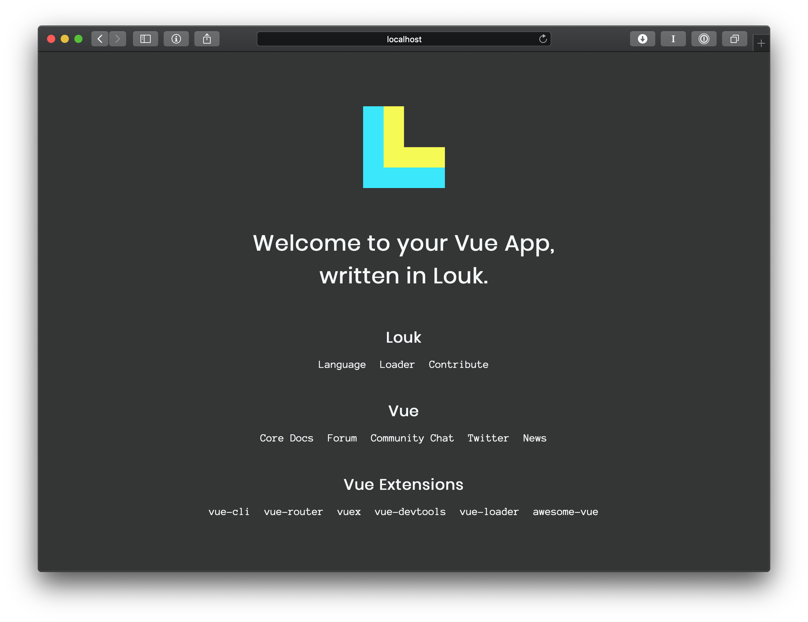

# Louk Intro

A starter template for [Louk](http://louk-lang.org)



## Instructions

1. Clone this repository
```
git clone git@github.com:louk-lang/louk-intro.git
```
2. Install npm modules
```
npm install
```
3. Run your development server
```
npm run serve
```
4. Build for production
```
npm run build
```
